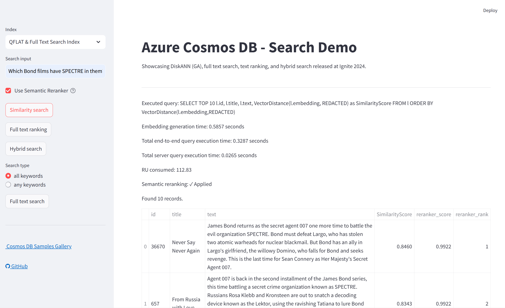

# FABCON Europe 2025 Search Demo with Azure Cosmos DB + Semantic Reranking

This repository contains a Python Streamlit application that demonstrates advanced search capabilities using Azure Cosmos DB, OpenAI embeddings, and semantic reranking. The application showcases vector search, full text search, text ranking, and hybrid search with intelligent semantic reranking to improve result relevance.



## ✨ Features

- **Multi-Modal Search Integration** with Azure Cosmos DB:
  - 🔍 **Semantic search** for movies using OpenAI embeddings
  - 📝 **Full text search** with advanced text processing
  - 🔄 **Hybrid search** combining semantic and full text search
  - 📊 **Text ranking** for enhanced result ordering
- **🎯 Semantic Reranking** (NEW):
  - Built-in Azure Cosmos DB SDK semantic reranking
  - Interactive UI toggle to enable/disable reranking
  - Preserves original metadata while improving result relevance
  - Uses DefaultAzureCredential for secure authentication
- **📈 Multiple Index Support**:
  - No Index baseline
  - QFLAT vector index for balanced performance
  - DiskANN vector index for high-scale scenarios
- **🛡️ Robust Error Handling**:
  - Graceful credential validation
  - Helpful troubleshooting messages
  - Fallback modes when services are unavailable
- **🎨 Interactive UI** built with Streamlit

## Prerequisites

- [Azure Cosmos DB](https://azure.microsoft.com/services/cosmos-db/) account with NoSQL API with vector search and full text search enabled
- [Azure OpenAI](https://azure.microsoft.com/products/ai-services/openai-service) account
- [Azure CLI](https://docs.microsoft.com/cli/azure/install-azure-cli) (for local authentication)

## 🚀 Quick Start

### 1. Clone and Setup

```sh
git clone https://github.com/TheovanKraay/fabcon-euro-25-multi-agent-ai-apps.git
cd fabcon-euro-25-multi-agent-ai-apps/cosmos-search-demo
```

### 2. Configure Environment Variables

Copy the template and configure your credentials:

```sh
cp src/app/.env.template src/app/.env
```

Edit `src/app/.env` with your actual Azure service credentials:

```env
# Azure Cosmos DB Configuration (Keyless Authentication)
COSMOS_FABCON_URI=https://your-cosmos-db.documents.azure.com:443/

# Azure OpenAI Configuration
AZURE_OPENAI_API_KEY=your_openai_api_key_here
OPENAI_ENDPOINT=https://your-openai.openai.azure.com/

# Semantic Reranker Configuration (Required for built-in reranker)
AZURE_COSMOS_SEMANTIC_RERANKER_INFERENCE_ENDPOINT=https://your-reranker-endpoint.dbinference.azure.com

# Notes:
# - DefaultAzureCredential is used for Cosmos DB authentication (no key required)
# - Ensure your Azure identity has "Cosmos DB Built-in Data Contributor" role
# - Semantic reranking uses built-in Cosmos SDK but requires endpoint configuration
# - In Azure environments, authentication happens automatically via Managed Identity
# - For local development, use 'az login' to authenticate via Azure CLI
```

### 3. Authentication Setup

The app uses **keyless authentication** with Azure Cosmos DB:

**🆔 DefaultAzureCredential (Recommended)**:
- Uses `DefaultAzureCredential` for secure authentication
- **Local Development**: Uses Azure CLI (`az login`)
- **Azure Deployment**: Uses Managed Identity automatically
- **Required**: Your identity needs "Cosmos DB Built-in Data Contributor" role
- **Benefits**: More secure, no secrets in configuration

### 4. Install Dependencies

```sh
pip install -r src/app/requirements.txt
```

### 5. Authenticate with Azure (Local Development)

```sh
az login
```

### 6. Run the Application

#### Option A: Basic Run (for testing without semantic reranker)
```sh
streamlit run src/app/cosmos-app.py --server.port 8501
```

#### Option B: Run with Semantic Reranker Support (Recommended)

For the semantic reranker to work properly with the preview Cosmos SDK, you need to export the endpoint environment variable in the same session:

**PowerShell (Windows):**
```powershell
$env:AZURE_COSMOS_SEMANTIC_RERANKER_INFERENCE_ENDPOINT = "https://your-reranker-endpoint.dbinference.azure.com"; streamlit run src/app/cosmos-app.py --server.port 8501
```

**For development with virtual environment:**
```powershell
$env:AZURE_COSMOS_SEMANTIC_RERANKER_INFERENCE_ENDPOINT = "https://your-reranker-endpoint.dbinference.azure.com"; .\.venv\Scripts\Activate.ps1; cd "cosmos-search-demo\src\app"; streamlit run cosmos-app.py --server.port 8501
```

**Bash (Linux/macOS):**
```bash
export AZURE_COSMOS_SEMANTIC_RERANKER_INFERENCE_ENDPOINT="https://your-reranker-endpoint.dbinference.azure.com" && streamlit run src/app/cosmos-app.py --server.port 8501
```

> **💡 Important Note**: Replace `https://your-reranker-endpoint.dbinference.azure.com` with your actual semantic reranker endpoint. The preview Cosmos SDK requires this environment variable to be exported in the same session as the application startup.

## 🎯 Using the Semantic Reranker

The application includes Azure Cosmos DB's built-in semantic reranker for improved search relevance:

### Features:
- **Built-in Integration**: Uses Azure Cosmos DB SDK `semantic_rerank()` method
- **Smart Ranking**: Reorders search results based on semantic similarity to your query
- **UI Toggle**: Enable/disable reranking with the checkbox in the sidebar
- **Metadata Preservation**: Maintains all original result data (IDs, titles, scores)
- **Seamless Authentication**: Uses the same DefaultAzureCredential as Cosmos DB

### How to Use:
1. **Start the app with the reranker endpoint exported** (see Run the Application section)
2. **Check the "Use Semantic Reranker" checkbox** in the sidebar
3. **Perform any search** (vector, text, or hybrid)
4. **Compare results** with and without reranking enabled
5. **View reranking status** in the results display

### Requirements:
- **Endpoint Configuration**: Must set `AZURE_COSMOS_SEMANTIC_RERANKER_INFERENCE_ENDPOINT`
- **Environment Export**: Must export the endpoint variable during app startup
- **Authentication**: Uses your existing Cosmos DB credentials (DefaultAzureCredential)

### Benefits:
- **Built-in SDK Integration**: No external API calls required
- **Consistent Authentication**: Uses your existing Cosmos DB credentials
- **Automatic Fallback**: App continues working even if reranking fails

## 📁 Project Structure

```
cosmos-search-demo/
├── src/
│   ├── app/
│   │   ├── cosmos-app.py          # Main Streamlit application
│   │   ├── requirements.txt      # Python dependencies
│   │   ├── .env.template         # Environment variable template
│   │   └── .env                  # Your credentials (not in git)
│   └── data/
│       ├── data-loader.py        # Data ingestion script
│       └── drop-containers.py    # Container cleanup utility
├── README.md
└── .gitignore
```

## 🔧 Advanced Configuration

### Environment Variables Reference:

| Variable | Description | Required |
|----------|-------------|----------|
| `COSMOS_FABCON_URI` | Azure Cosmos DB endpoint | ✅ |
| `AZURE_OPENAI_API_KEY` | Azure OpenAI API key | ✅ |
| `OPENAI_ENDPOINT` | Azure OpenAI endpoint | ✅ |
| `AZURE_COSMOS_SEMANTIC_RERANKER_INFERENCE_ENDPOINT` | Semantic reranker endpoint (required for reranker functionality) | 🎯 |

*✅ = Required*  
*🎯 = Required for semantic reranking feature*

**Note**: Semantic reranking uses the built-in Cosmos DB SDK but requires the endpoint configuration and must be exported as an environment variable during application startup.

### Authentication:

**Cosmos DB & Semantic Reranker Authentication:**
- **Local Development**: Uses Azure CLI authentication (`az login`)
- **Azure Deployment**: Uses Managed Identity authentication automatically
- **DefaultAzureCredential**: Handles authentication flow seamlessly
- **Required Role**: "Cosmos DB Built-in Data Contributor" on your Cosmos DB account

## 🚀 Deploy to Azure with VS Code

### Prerequisites:
- Azure subscription with App Service capabilities
- VS Code with Azure App Service extension

### Steps:

1. **Install the Azure App Service extension**:
   - Open Extensions view (Ctrl+Shift+X)
   - Search for "Azure App Service" and install

2. **Create Azure Web App**:
   - Create [Azure Web App](https://learn.microsoft.com/azure/app-service/overview) 
   - Use Linux service plan (B1 SKU or higher)
   - Select Python 3.10+ runtime

3. **Configure App Service**:
   - Go to Configuration → General Settings
   - Set **Startup Command**:
     ```shell
     python -m pip install -r src/app/requirements.txt && python -m streamlit run src/app/cosmos-app.py --server.port 8000 --server.address 0.0.0.0
     ```
   - Add environment variables in Configuration → Application Settings

4. **Deploy**:
   - Press Ctrl+Shift+P
   - Select "Azure App Service: Deploy to Web App"
   - Select this project folder
   - Choose your subscription and Web App
   - Wait for deployment (up to 5 minutes)

### 🔐 Production Security:
- Use **Managed Identity** for Azure service authentication
- Store sensitive values in **Azure Key Vault**
- Configure **Application Settings** instead of .env files

## 📊 Loading Data into Cosmos DB

The app automatically creates containers with proper vector and text search policies. Use the data loader to populate with your data:

### Basic Usage:
```sh
cd src/data
python data-loader.py \
  --text_field_name "overview" \
  --path_to_json_array "your-data.json" \
  --database_name "fabcon25demo" \
  --concurrency 20 \
  --re_embed True
```

### Movie Dataset Example:
```sh
python src/data/data-loader.py \
  --text_field_name "overview" \
  --path_to_json_array "https://raw.githubusercontent.com/microsoft/AzureDataRetrievalAugmentedGenerationSamples/refs/heads/main/DataSet/Movies/MovieLens-4489-256D.json" \
  --database_name "fabcon25demo" \
  --concurrency 20 \
  --vector_field_name "vector" \
  --re_embed True
```

### 🗑️ Container Management:
Use the cleanup utility to remove containers:
```sh
python src/data/drop-containers.py
```

## 🤝 Contributing

1. Fork the repository
2. Create a feature branch: `git checkout -b feature/amazing-feature`
3. Commit changes: `git commit -m 'Add amazing feature'`
4. Push to branch: `git push origin feature/amazing-feature`
5. Open a Pull Request

## 📝 License

This project is licensed under the MIT License - see the LICENSE file for details.

## 🆘 Support & Troubleshooting

### Common Issues:

**❌ "Failed to connect to Cosmos DB"**
- Verify `COSMOS_FABCON_URI` in .env
- Run `az login` to authenticate
- Check that your account has "Cosmos DB Built-in Data Contributor" role
- Check network connectivity to Azure

**❌ "Semantic reranking failed"**
- Ensure you're authenticated: `az login`
- Verify your account has access to the Cosmos DB account
- Check that the Cosmos DB account supports semantic reranking
- App will continue working with original search results

**❌ "No results found"**
- Ensure data is loaded into Cosmos containers
- Check container names match the app configuration

### Performance Tips:
- Use **DiskANN index** for large datasets (>100K documents)
- Use **QFLAT index** for balanced performance and cost
- Adjust **concurrency** in data loader based on Cosmos DB throughput

### 📞 Need Help?
- Check the [Issues](https://github.com/TheovanKraay/fabcon-euro-25-multi-agent-ai-apps/issues) page
- Review Azure Cosmos DB [documentation](https://docs.microsoft.com/azure/cosmos-db/)
- Consult Azure OpenAI [best practices](https://docs.microsoft.com/azure/cognitive-services/openai/)
